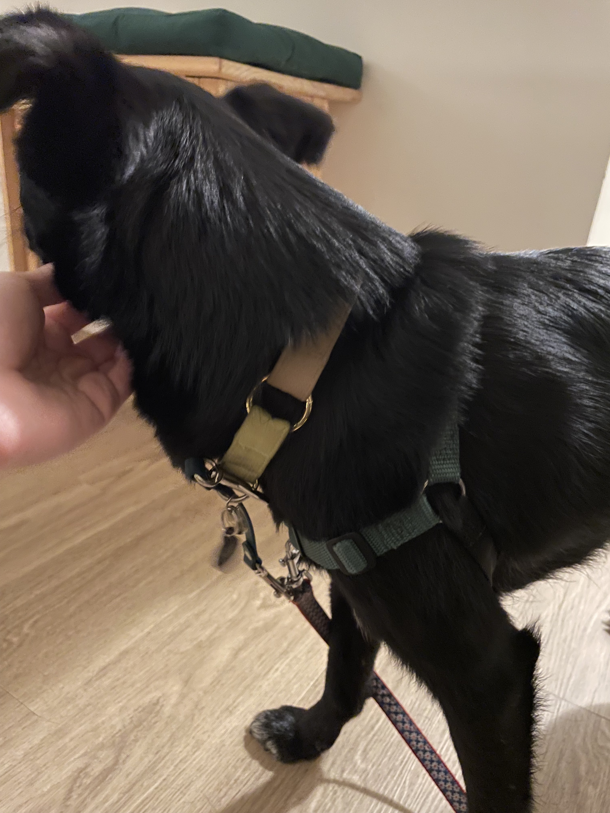
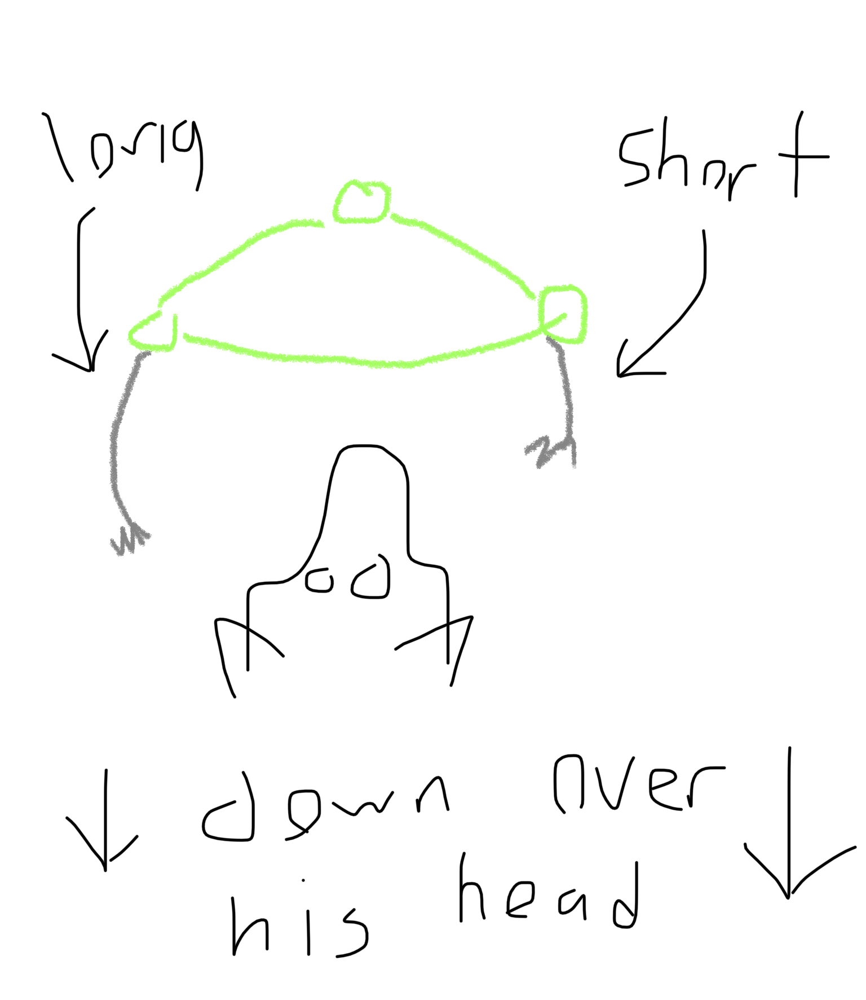
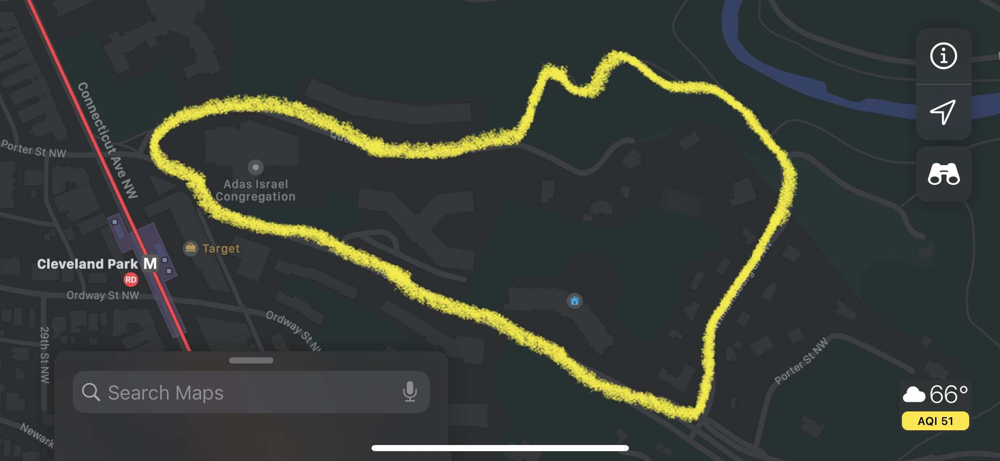
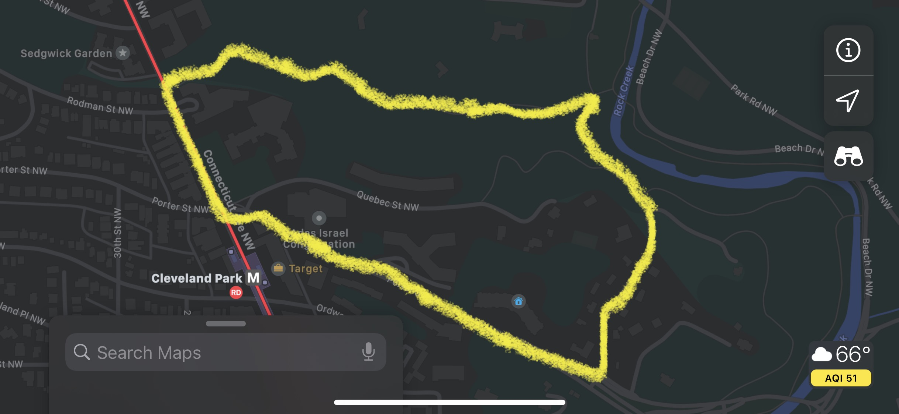
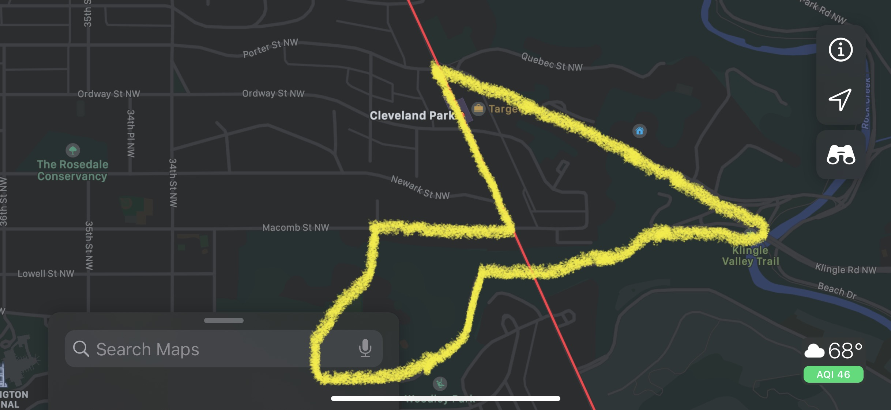
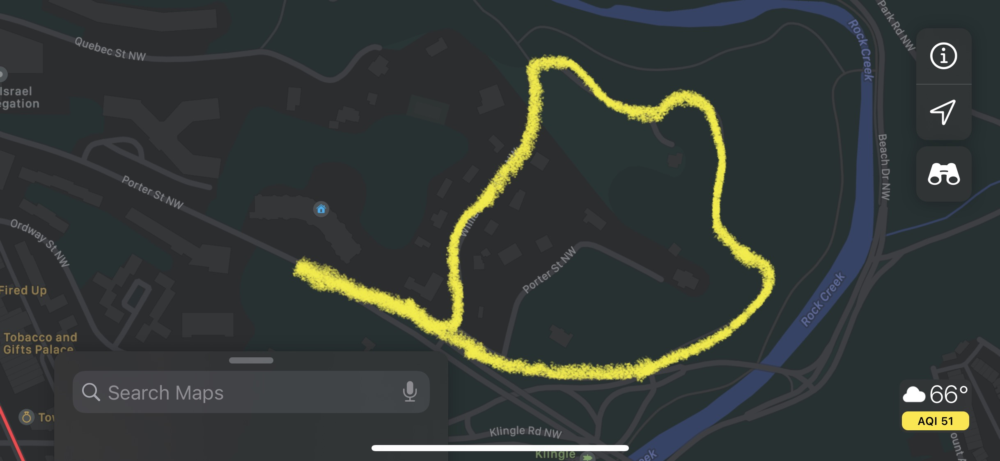

# Walking the Dog

Nua goes on walks three times a day! The morning one is his favorite.

## Setup

He wears two pieces when going outside, a collar and a harness. The harness is the main thing that he'll feel resistance on, the collar is just there as a backup and to hold an airtag.

His leash has two clips. Attach the larger (main) one to his harness (the ring in front of his chest) and the smaller (auxiliary, green) one  to his collar.

See these photos for how to put on the harness! Note the black parts buckle under his arms:

|  |  |
|-|-|

I also have this great little miniature pooper scooper so you don’t have to touch the poop, it has bags in it and you just line it with one before you go, take that with you!

## The Walk

He likes when each one is usually around 20-30 minutes. The nighttime one can be shorter (often just up to Connecticut Avenue and then back down to the building is ok).

He walks pretty fast and then stops on a dime to smell something, just be ready for that, lol.

He sniffs stuff for a long time sometimes, he’s _very thorough_, you don’t need to pull him or anything, he’ll eventually pee once he finds the perfect place (just make sure he’s not eating anything).

Always hold the leash tightly! At the end of the day, he’s a spaz, and would happily run into traffic.

Regarding other dogs -- he's very friendly and often wants to meet them, but _they_ are often not as friendly, so it's easiest to just avoid them by crossing the street etc!

He sometimes has strong opinions on which way to go or when he wants to cross the street. Frankly I suggest just giving up and doing what he wants, he will act like you are pulling him into Mount Doom if you try to keep walking a way he doesn't want to go, total baby.

See photos for suggested routes! Each one takes 20-30 minutes:

|  |  |
|:--------:|:-----------:|
|  |  |

Note each one is a loop -- he doesn't like to just "turn around" because as mentioned he's a baby.
